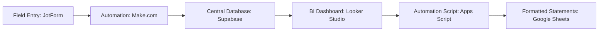

# BI-Project-For-Trucking-Company
An end-to-end data pipeline that automates data ingestion, processes financial calculations, and provides interactive tracking tools for a trucking business. This project connects field driver tickets to a central Supabase database, displays metrics on an interactive executive dashboard, and allows users to export professionally formatted earning statements with a single click.

📋 **Project Overview & Executive Summary**

In fast-paced logistics operations, managing field load tickets, fluctuating fuel prices, and varying driver contract rates manually often causes data entry errors, delayed billing cycles, and limited financial visibility.

This solution establishes a completely automated data ecosystem:

  **1. Automated Collection:** Submitted load tickets are captured instantly.

  **2. Supabase Data Hub:** A cloud-based Supabase (PostgreSQL) database handles all data storage and background calculations (such as dynamic fuel surcharges     and dispatch fees) automatically behind the scenes.

  **3. Control Center:** An interactive dashboard allows management to monitor revenue pools, load frequencies, and route performance in real time.

  **4. Instant Invoicing:** Billing administrators can select an accounting window on the dashboard and click a link to generate custom-formatted, self-calculating spreadsheet statements automatically.

  🛠️ **Tools**

**Data Ingestion:** JotForm for field data entry, routed instantly using Make (formerly Integromat) automation webhooks.

**Database Management:** Supabase / PostgreSQL for secure relational data tables, specialized processing routines, and live analytics views.

**Business Intelligence:** Looker Studio for interactive executive tracking dashboards and parameter filtering.

**Automation Layer:** Google Apps Script (JavaScript) for communicating with the database and dynamically building formatted spreadsheets.

🔄 **System Architecture & Data Journey**

**1. Ingestion:** Drivers input their load summaries (tonnage, locations, ticket numbers) into a digital form. Make automatically structuralizes this text data and sends it directly to Supabase.

**2. Standardization:** On arrival, the database automatically cleans typos, spacing, and accidental accents to ensure field entries perfectly match official driver registries.

**3. Dynamic Rate Evaluation:** Supabase looks at the delivery date and locations of each load, automatically pulling the correct matching rates and corresponding fuel surcharges valid for that specific day.

**4. Reporting & Action:** Cleaned summaries sync directly from Supabase to Looker Studio. From here, administrators use active filters to sort dates or companies and click embedded action rows to trigger document automation.

📊 **Dashboard Insights & Business Intelligence**

The dashboard serves as the operational headquarters, providing immediate insight into critical fleet variables synced straight from Supabase:

**Executive Scorecards:** Live monitoring counters tracking aggregate loads, subtotals, dispatch fees, fuel surcharges, and total net revenue.

**Time-Series Analysis:** Double-axis charting cross-referencing trip volume fluctuations alongside historical financial trends month-over-month.

**Route Efficiency Logs:** Bar graphs isolating performance velocity across various route combinations, defining which lanes handle the heaviest logistics weight.

**Parameter Bridges:** Built-in customized text parameter controls that bridge user browser filters with target automation scripts, guaranteeing that what the admin sees on screen is exactly what gets printed to the spreadsheet.

📈 **Operational Impact**

**Eliminated Delays:** Statement generation times were reduced from hours of manual spreadsheet copying to a one-click automated process.

**Zero Math Errors:** Moving calculation formulas from manual spreadsheet entries directly into backend database views guarantees 100% accurate billings.

**Complete Transparency:** Management can view live metrics, profit margins, and distribution data instantly instead of waiting for end-of-month closed books.

📂 **Repository File Guide**

schema.sql - Database tables, indexes, and rate parameters.

trigger.sql - Text cleaning routines and standardizing.

view.sql - Calculations for accurate and pertinent insights. 

statement_generator.js - Google Apps Script document automation code.

  
